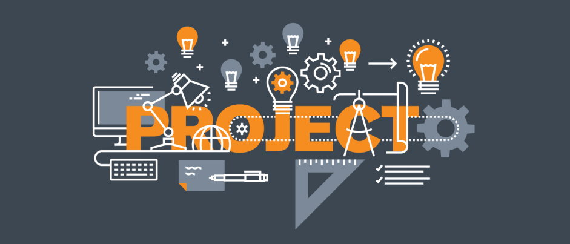

# Table of Contents
1. Project's Title 
2. Project's Description
3. Installation
4. Contributors
 
 

## 1. Project's Title
*This is the name of the project. It describes the whole project in one sentence, and helps 
people understand **what** the main goal and aim of the project is.*

 

## 2. Project Description

This is an important component of your project that many new developers often overlook. 

 

Your description is an extremely important aspect of your project. A well-crafted description allows you to show off your work to other developers as well as potential employers.

 

*The quality of a README description often differentiates a good project from a bad project. A good one takes advantage of the opportunity to explain and showcase:*

- What your application does,
- Why you used the technologies you used,
- Some of the challenges you faced and features you hope to implement in the future.

 

[Click]() here for more details.

 

## 3. Installation

*Below is an example of how you can instruct your audience on installing and setting up your app. This template doesn't rely on any external dependencies or services.*

1. Get a free API Key at this [link]()
2. Clone the repo 
    
`git clone https://github.com/your_username_/Project-Name.git`
1. Install NPM packages 
     `npm install`
2. Enter your API in config.js 
     `const API_KEY = 'ENTER YOUR API';`

 

## 4. Contributors

Thank you to the following contributors who have helped to improve this project: 

| Name | Email | Phone| 
| ------ | ------ | ------|
| Ujjal K Saha | ujjal.kumer@bjitgroup.com | +932105711
| Md. Rahat Ibna Hossain | rahat.hossain@bjitacademy.com | 01580661685
| Barha Meherun Pritha | meherun.pritha@bjitacademy.com | 01829671640
| Kazi Md Nazmul Hoque | kazi.nazmul@bjitacademy.com | 01850320559
| Md. Taslim Hosen Shanto | md.taslim@bjitacademy.com | 01747538382
 

